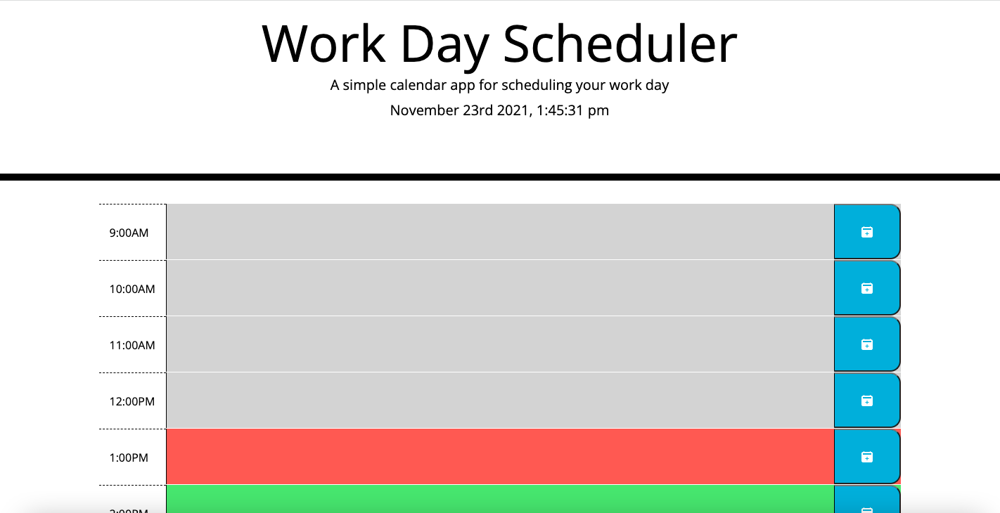

## User Story
WHEN I launch the webpage
THEN I am presented with the current day/time and timeblockds for standard working hours
WHEN viewing the timeblocks
THEN I see they are color coded to indicate past(grey), present(red), and future(red)
WHEN I click the textarea of the timeblock
THEN I can input an appointment
WHEN I click the corresponding save button
THEN the appointment is saved to local storage
WHEN I refresh the day planner
THEN the saved events persist

## Deployed Site
https://mbrunostem.github.io/day-planner/

