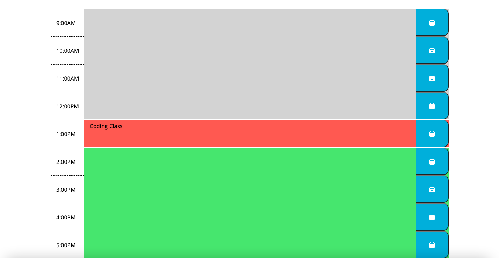

# Day Planner 

## Description
Keep track of your busy schedule by saving all your appointments you day planner.

## User Story
- WHEN I launch the webpage
- THEN I am presented with the current day/time and timeblockds for standard working hours
- WHEN viewing the timeblocks
- THEN I see they are color coded to indicate past(grey), present(red), and future(green)
- WHEN I click the textarea of the timeblock
- THEN I can input an appointment
- WHEN I click the corresponding save button
- THEN the appointment is saved to local storage
- WHEN I refresh the day planner
- THEN the saved events persist

## Technologies Used
- HTML
- CSS
- Javascipt

## License
The MIT License is a permissive free software license originating at the Massachusetts Institute of Technology (MIT) in the late 1980s. As a permissive license, it puts only very limited restriction on reuse and has, therefore, high license compatibility.

## Deployed Site
[Link](https://mbrunostem.github.io/day-planner/)

## Landing Page

## Contributors
Mario Bruno
* [GitHub](https://github.com/MBrunoStem)
* mbrunostem@gmail.com